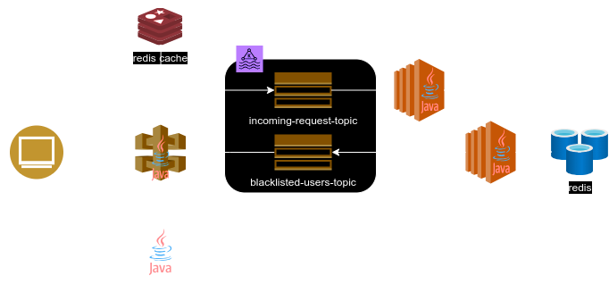

# Kafka Message Proxy Service



This microservice is responsible for ...


## Runtime requeriments

* **Kafka** - it must be run on port 9092.

### Run application
```bash
./run.sh
```

## Swagger UI

http://localhost:7070/


## Check message on a Kafka topic

It's possible to jump into kafka server using ssh, or connect to the container if it is running in a docker container,
and the following command will allow you to see the message which are generated by this service on topic "request-dlq"

```bash
/bin/kafka-console-consumer --bootstrap-server localhost:9092 --from-beginning --topic request-dlq
```
